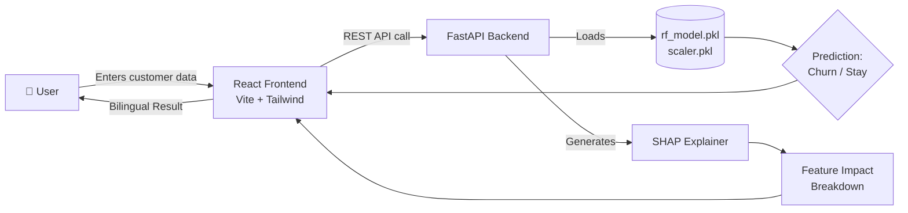

<div align="center">

# 🚀 Customer Churn Predictor

### Enterprise-Grade ML System for Predicting & Explaining Customer Churn

An intelligent, full-stack churn prediction platform powered by **Machine Learning**, **Explainable AI (SHAP)**, and a **bilingual (English/Sinhala)** interactive interface.

[](https://www.python.org/)
[](https://fastapi.tiangolo.com/)
[](https://react.dev/)
[](https://vitejs.dev/)
[](https://tailwindcss.com/)
[](https://scikit-learn.org/)
[](https://www.docker.com/)
[](https://cloud.google.com/run)

[](./LICENSE)
[](../../stargazers)
[](../../issues)
[](../../commits/main)

<br/>

&nbsp;&nbsp;
&nbsp;&nbsp;
&nbsp;&nbsp;
&nbsp;&nbsp;
&nbsp;&nbsp;
&nbsp;&nbsp;


</div>

<br/>

## 📖 Table of Contents

- [🚀 Customer Churn Predictor](#-customer-churn-predictor)
    - [Enterprise-Grade ML System for Predicting \& Explaining Customer Churn](#enterprise-grade-ml-system-for-predicting--explaining-customer-churn)
  - [📖 Table of Contents](#-table-of-contents)
  - [🎯 Overview](#-overview)
  - [✨ Key Features](#-key-features)
  - [🛠️ Tech Stack](#️-tech-stack)
  - [🏗️ System Architecture](#️-system-architecture)
  - [📁 Project Structure](#-project-structure)
  - [⚙️ Getting Started](#️-getting-started)
    - [Prerequisites](#prerequisites)
    - [1️⃣ Clone the Repository](#1️⃣-clone-the-repository)
    - [2️⃣ Backend Setup](#2️⃣-backend-setup)
    - [3️⃣ Frontend Setup](#3️⃣-frontend-setup)
    - [4️⃣ (Optional) Train the Model Yourself](#4️⃣-optional-train-the-model-yourself)
  - [🔐 Environment Variables](#-environment-variables)
  - [📡 API Reference](#-api-reference)
  - [🧬 Model \& Explainability](#-model--explainability)
  - [🐳 Docker Deployment](#-docker-deployment)
    - [Deploy to Google Cloud Run](#deploy-to-google-cloud-run)
  - [🖼️ Screenshots](#️-screenshots)
  - [🗺️ Roadmap](#️-roadmap)
  - [👥 Team](#-team)
  - [🤝 Contributing](#-contributing)
  - [📄 License](#-license)

<br/>

## 🎯 Overview

**Customer Churn Predictor** is a machine learning system that predicts whether a customer is likely to churn (leave a service) or stay, and — critically — **explains why**. Instead of a black-box prediction, the system uses **SHAP (SHapley Additive exPlanations)** to break down exactly which features drove each prediction, making it usable for real business decision-making.

The platform ships as a full monorepo: a trained **Random Forest** model, a **FastAPI** backend serving predictions, and a **React + Vite** frontend with a clean, no-scroll, bilingual (🇬🇧 English / 🇱🇰 Sinhala) UI — all containerized and ready for **Google Cloud Run**.

<br/>

## ✨ Key Features

| Feature | Description |
|---|---|
| 🔮 **Churn Prediction** | Real-time churn/stay predictions from customer data using a trained Random Forest classifier |
| 🧠 **Explainable AI** | SHAP-powered breakdowns showing exactly which features influenced each prediction |
| 🌐 **Bilingual UI** | Fully localized interface supporting **English** and **Sinhala** |
| 📱 **Responsive Design** | No-scroll, mobile-friendly layout built with Tailwind CSS |
| ⚡ **Fast API Layer** | High-performance REST API built with FastAPI + Uvicorn |
| 🐳 **Containerized** | Dockerfiles for both frontend and backend, ready for cloud deployment |
| ☁️ **Cloud-Native** | Deployable out-of-the-box to Google Cloud Platform (Cloud Run) |
| 📊 **Data Pipeline** | Full ML pipeline from raw data → preprocessing → training → evaluation |

<br/>

## 🛠️ Tech Stack

<table>
<tr>
<td valign="top" width="33%">

**Frontend**
- React (Function Components)
- Vite
- Tailwind CSS
- ESLint

</td>
<td valign="top" width="33%">

**Backend**
- FastAPI
- Uvicorn
- Python 3.10+
- Pydantic

</td>
<td valign="top" width="33%">

**Machine Learning**
- Scikit-Learn (Random Forest)
- Pandas / NumPy
- SHAP
- Joblib / Jupyter

</td>
</tr>
</table>

**Deployment:** Docker · Google Cloud Platform (Cloud Run)

<br/>

## 🏗️ System Architecture



<br/>

## 📁 Project Structure

```text
IJSE-ML-Group-Project-Customer-Churn-Predictor/
├── backend/                  # REST API built with FastAPI
│   ├── app/                  # Application source code
│   ├── .gitignore
│   ├── README.md             # Backend setup guide
│   └── requirements.txt      # Python dependencies
│
├── frontend/                 # React application built with Vite
│   ├── public/
│   ├── src/                  # React source code and assets
│   ├── .gitignore
│   ├── eslint.config.js
│   ├── index.html
│   ├── package.json
│   ├── package-lock.json
│   ├── postcss.config.js
│   ├── README.md             # Frontend setup guide
│   ├── tailwind.config.js
│   └── vite.config.js
│
├── ml/                        # Machine learning pipelines
│   ├── data/
│   │   └── raw_data.csv       # Raw dataset
│   ├── models/
│   │   ├── rf_model.pkl        # Trained Random Forest model
│   │   └── scaler.pkl          # Data scaler
│   ├── notebooks/
│   │   └── train_model.ipynb   # Model training and SHAP analysis
│   └── README.md               # ML setup guide
│
├── .dockerignore              # Excluded files for Docker builds
├── Dockerfile.backend         # Dockerfile for FastAPI backend
├── Dockerfile.frontend        # Dockerfile for React frontend
└── README.md                  # This root documentation file
```

<br/>

## ⚙️ Getting Started

### Prerequisites

- **Node.js** ≥ 18.x and npm
- **Python** ≥ 3.10
- **Docker** (optional, for containerized runs)
- **Git**

### 1️⃣ Clone the Repository

```bash
git clone https://github.com/hasinduudara/IJSE-ML-Group-Project-Customer-Churn-Predictor.git
cd IJSE-ML-Group-Project-Customer-Churn-Predictor
```

### 2️⃣ Backend Setup

```bash
cd backend
python -m venv venv
source venv/bin/activate      # On Windows: venv\Scripts\activate
pip install -r requirements.txt
uvicorn app.main:app --reload --port 8000
```

The API will be available at `http://localhost:8000` (interactive docs at `/docs`).

### 3️⃣ Frontend Setup

```bash
cd frontend
npm install
npm run dev
```

The app will be available at `http://localhost:5173`.

### 4️⃣ (Optional) Train the Model Yourself

```bash
cd ml
jupyter notebook notebooks/train_model.ipynb
```

> For more detail, see the dedicated guides: [Frontend](./frontend/README.md) · [Backend](./backend/README.md) · [ML](./ml/README.md)

<br/>

## 🔐 Environment Variables

Create a `.env` file in `backend/` (and `frontend/` if applicable):

```env
# backend/.env
MODEL_PATH=ml/models/rf_model.pkl
SCALER_PATH=ml/models/scaler.pkl
ALLOWED_ORIGINS=http://localhost:5173
```

```env
# frontend/.env
VITE_API_BASE_URL=http://localhost:8000
```

<br/>

## 📡 API Reference

| Method | Endpoint | Description |
|---|---|---|
| `GET` | `/health` | Health check for the API service |
| `POST` | `/predict` | Returns churn prediction for given customer data |
| `POST` | `/explain` | Returns SHAP-based feature explanations for a prediction |

**Example request:**

```bash
curl -X POST http://localhost:8000/predict \
  -H "Content-Type: application/json" \
  -d '{
        "tenure": 12,
        "monthly_charges": 70.5,
        "contract_type": "Month-to-month"
      }'
```

Full interactive documentation is auto-generated by FastAPI at `/docs` (Swagger UI) and `/redoc`.

<br/>

## 🧬 Model & Explainability

- **Algorithm:** Random Forest Classifier (`scikit-learn`)
- **Preprocessing:** Feature scaling via a saved `scaler.pkl`
- **Explainability:** [SHAP](https://github.com/shap/shap) values computed per-prediction to show which features (e.g. tenure, contract type, monthly charges) pushed the outcome toward churn or retention
- **Training:** Documented step-by-step in `ml/notebooks/train_model.ipynb`, including data cleaning, feature engineering, model evaluation, and SHAP analysis

<br/>

## 🐳 Docker Deployment

Build and run each service independently:

```bash
# Backend
docker build -f Dockerfile.backend -t churn-backend .
docker run -p 8000:8000 churn-backend

# Frontend
docker build -f Dockerfile.frontend -t churn-frontend .
docker run -p 5173:80 churn-frontend
```

### Deploy to Google Cloud Run

```bash
# Backend
gcloud run deploy churn-backend \
  --source . \
  --dockerfile Dockerfile.backend \
  --platform managed \
  --region asia-south1 \
  --allow-unauthenticated

# Frontend
gcloud run deploy churn-frontend \
  --source . \
  --dockerfile Dockerfile.frontend \
  --platform managed \
  --region asia-south1 \
  --allow-unauthenticated
```

<br/>

## 🖼️ Screenshots

> _Add screenshots or a demo GIF here once available — e.g. `docs/screenshot-dashboard.png`_

<div align="center">

| Prediction View | Explainability View |
|---|---|
| _screenshot placeholder_ | _screenshot placeholder_ |

</div>

<br/>

## 🗺️ Roadmap

- [ ] Add authentication for API access
- [ ] Support batch predictions via CSV upload
- [ ] Add model versioning and A/B testing
- [ ] Expand SHAP visualizations (waterfall & force plots in-app)
- [ ] Add more languages beyond English/Sinhala
- [ ] CI/CD pipeline for automated deployment

<br/>

## 👥 Team

This project was built by a dedicated team of Software Engineering students at **IJSE**:

| Name | GitHub |
|---|---|
| **Hasindu Udara** | [@hasinduudara](https://github.com/hasinduudara) |
| **Kavindu Avishka** | [@Avishka30](https://github.com/Avishka30) |
| **Dilmi Kaushalya** | [@dil2003-av](https://github.com/dil2003-av) |
| **Dulanji Amanda** | [@Dulanji-Amanda](https://github.com/Dulanji-Amanda) |
| **Nethmi Diwyanga** | [@NethmiDN](https://github.com/NethmiDN) |

<br/>

## 🤝 Contributing

Contributions are welcome!

1. Fork the repository
2. Create your feature branch (`git checkout -b feature/amazing-feature`)
3. Commit your changes (`git commit -m 'Add some amazing feature'`)
4. Push to the branch (`git push origin feature/amazing-feature`)
5. Open a Pull Request

<br/>

## 📄 License

This project is licensed under the **MIT License** — see the [LICENSE](./LICENSE) file for details.

<br/>

<div align="center">

Made with ❤️ by the Customer Churn Predictor Team

</div>