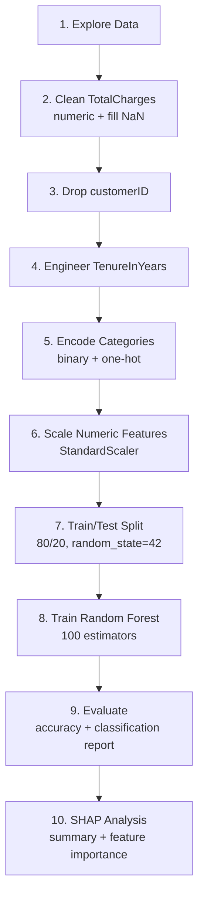

<div align="center">

# 🧠 Customer Churn Predictor — Machine Learning

### Data, Training Pipeline & Model Artifacts

[](https://scikit-learn.org/)
[](https://pandas.pydata.org/)
[](https://github.com/shap/shap)
[](https://jupyter.org/)

</div>

<br/>

## 📖 Table of Contents

- [🧠 Customer Churn Predictor — Machine Learning](#-customer-churn-predictor--machine-learning)
    - [Data, Training Pipeline \& Model Artifacts](#data-training-pipeline--model-artifacts)
  - [📖 Table of Contents](#-table-of-contents)
  - [🎯 Overview](#-overview)
  - [📁 Directory Structure](#-directory-structure)
  - [📊 Dataset](#-dataset)
  - [🔬 Training Pipeline](#-training-pipeline)
  - [▶️ Running the Notebook](#️-running-the-notebook)
  - [📦 Generated Artifacts](#-generated-artifacts)
  - [🔗 Backend Integration](#-backend-integration)
  - [✅ Retraining Checklist](#-retraining-checklist)
  - [🩺 Troubleshooting](#-troubleshooting)

<br/>

## 🎯 Overview

The `ml` directory holds everything needed to reproduce the Customer Churn Predictor's model: the raw dataset, the full training/evaluation notebook, and the serialized artifacts (`rf_model.pkl`, `scaler.pkl`) that the FastAPI backend loads at runtime.

<br/>

## 📁 Directory Structure

```text
ml/
├── data/
│   └── raw_data.csv          # Raw IBM Telco Customer Churn dataset
├── models/
│   ├── rf_model.pkl          # Trained Random Forest model
│   └── scaler.pkl            # Fitted StandardScaler
├── notebooks/
│   └── train_model.ipynb     # Training, evaluation & SHAP analysis
└── README.md                 # This file
```

<br/>

## 📊 Dataset

| | |
|---|---|
| **Source** | IBM Telco Customer Churn dataset |
| **Location** | `ml/data/raw_data.csv` |
| **Contents** | Customer demographic, account, service, and churn information |
| **Target column** | `Churn` |

<br/>

## 🔬 Training Pipeline

The `notebooks/train_model.ipynb` notebook executes the following steps end-to-end:



| Step | Description |
|---|---|
| 1. Explore | Inspect data types, missing values, duplicates, and the `TotalCharges` quality issue |
| 2. Clean | Convert `TotalCharges` to numeric, fill missing values with `0` |
| 3. Drop | Remove the `customerID` column |
| 4. Engineer | Create `TenureInYears` from `tenure` |
| 5. Encode | Binary-encode two-class fields; one-hot encode multi-class fields |
| 6. Scale | Standardize `tenure`, `MonthlyCharges`, `TotalCharges`, `TenureInYears` via `StandardScaler` |
| 7. Split | 80% train / 20% test, `random_state=42` |
| 8. Train | `RandomForestClassifier` with 100 estimators |
| 9. Evaluate | Accuracy score + full classification report |
| 10. Explain | SHAP summary plots and feature-importance rankings |

<br/>

## ▶️ Running the Notebook

Install dependencies and launch Jupyter from the **repository root**:

```powershell
python -m pip install -r backend/requirements.txt
python -m pip install notebook ipykernel matplotlib seaborn
jupyter notebook ml/notebooks/train_model.ipynb
```

> ⚠️ **Important:** The notebook uses relative paths such as `../data/raw_data.csv`, so it must be opened/executed with `ml/notebooks` as the working directory. In VS Code, select a Python interpreter with the required packages installed before running any cells.

Run all cells **in order**, top to bottom.

<br/>

## 📦 Generated Artifacts

The final cells of the notebook save these files to `ml/models/`:

| File | Description |
|---|---|
| `rf_model.pkl` | Trained Random Forest model, including the feature names used during training |
| `scaler.pkl` | Fitted `StandardScaler` for the numeric features |

The backend loads **both files at startup** — keep the model's feature order and preprocessing steps synchronized with the backend's input schema whenever you retrain.

<br/>

## 🔗 Backend Integration

At inference time, the backend:

1. Derives `TenureInYears` from the incoming `tenure` value
2. Aligns incoming data with the exact feature columns used during training
3. Applies the saved `scaler.pkl` to numeric features
4. Runs the saved `rf_model.pkl` to produce a prediction
5. Uses **SHAP** to select the leading reasons behind that churn/stay prediction

<br/>

## ✅ Retraining Checklist

Use this checklist whenever you retrain the model:

- [ ] Run the full notebook top-to-bottom without errors
- [ ] Confirm `rf_model.pkl` and `scaler.pkl` were written to `ml/models/`
- [ ] Verify the feature order/names match what `backend/app` expects
- [ ] Re-run a sample `/predict` request against the backend to sanity-check output
- [ ] Restart the backend service so it loads the newly generated artifacts
- [ ] Commit updated `.pkl` files (or update your artifact storage/versioning strategy)

<br/>

## 🩺 Troubleshooting

| Issue | Likely Cause | Fix |
|---|---|---|
| `FileNotFoundError: ../data/raw_data.csv` | Notebook run from the wrong working directory | Launch Jupyter so `ml/notebooks` is the notebook's working directory |
| Backend predictions look wrong after retraining | Feature order/names changed but backend wasn't updated | Sync the backend's input schema with the notebook's final feature set |
| `ModuleNotFoundError` for `shap`/`seaborn` | Optional packages not installed | `pip install notebook ipykernel matplotlib seaborn shap` |
| Backend still using old model | Backend not restarted after retraining | Restart the FastAPI server to reload the `.pkl` files |